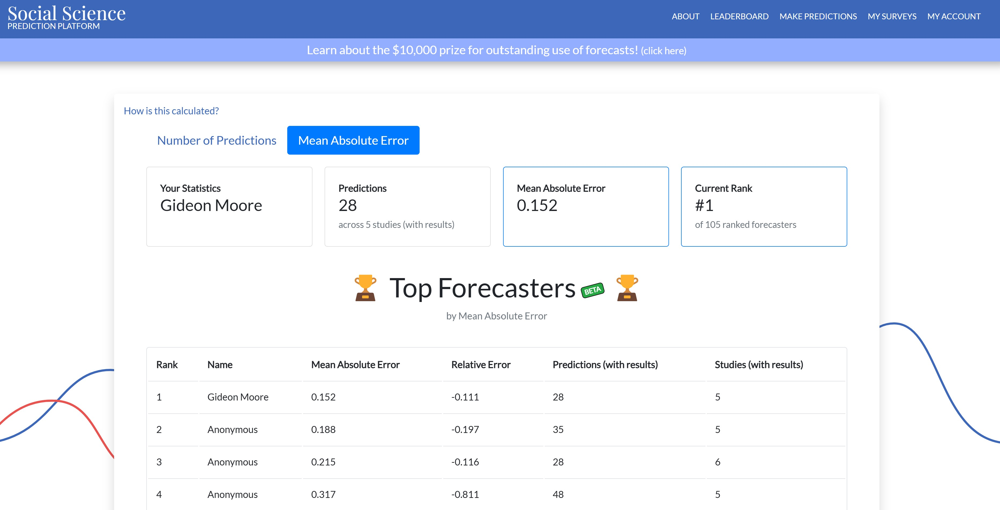

# Social Science Prediction Platform

For some period of time I was the #1 most accurate forecaster on the [Social Science Prediction Platform](https://socialscienceprediction.org/), a vehicle for experts to predict the effects of untested social programs. At the time of ranking, 105 forecasters had received rankings in terms of Mean Absolute Error. The SSPP is a project of Stefano DellaVigna and Eva Vivalt, among others. 

# Bowdoin College

At Bowdoin I received awards for my Economics work including:
* 1897 Noyes Political Economy Prize--Awarded to the best student in political economy each year
* High Honors in Economics--Awarded to students achieving distinction in economics coursework who complete a senior thesis
* _Magna cum Laude_--Awarded to students whose overall GPA is in the top 8% of graduating class
* Phi Beta Kappa--Membership in an academic honor society awarded to top ten percent of students in class
* Bowdoin Book Award--Awarded to students achieving straight 'A's for an entire academic year