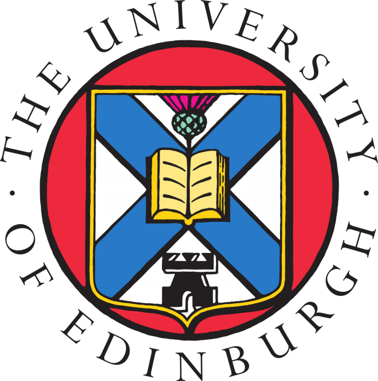

### **Graduate Student**

PhD student, started fall 2022.

### Coursework:
* _Industrial Organization_ sequence (2023-2024)
* _Labor Economics_ sequence (2023-2024)
* _Public Economics I_ (2023) and _Public Economics III_ (2024)
* _Contracts, Information, and Incentives_ with Ilya Segal
* Micro, Macro, and Econometrics core sequences (2022-2023)

### **Predoctoral Research Fellow**

### Coursework:
* _Machine Learning and Causal Inference_--Spring 2022 with Susan Athey and Stefan Wager
* _Mining Massive Datasets_--Winter 2022 with Jure Leskovic and Mina Ghashami
* _Economics of Higher Education_--Fall 2021 with Eric Bettinger
* _Behavioral and Experimental Economics III_--Spring 2021 with Doug Bernheim, Muriel Niederle, and Al Roth
* _Behavioral and Experimental Economics II_--Winter 2021 with Muriel Niederle
* _Behavioral and Experimental Economics I_--Fall 2020 with Doug Bernheim and Al Roth
* _Simplicity and Complexity in Economic Theory_--Spring 2020 with Mohammad Akbarpour and Paul Milgrom
* _Market Failures and Public Policy_--Winter 2020 with Liran Einav and Heidi Williams
* _Matching and Market Design_--Fall 2019 with Muriel Niederle, Michael Ostrovsky, and Al Roth

### **A. B., Economics and Mathematics, Minor in Computer Science**

### Economics Coursework
* Honors Thesis--Fall 2018-Spring 2019, supervised by John Fitzgerald
* _Behavioral Economics_--Spring 2019 with Dan Stone
* _Game Theory_--Fall 2018 with Dan Stone
* _Econometrics_--Fall 2017 with Stephen Morris
* _Evaluation of Public Programs_--Spring 2017 with John Fitzgerald

### Mathematics Coursework
* _Real Analysis_--Fall 2018 with Bill Barker
* _Numerical Methods_--Fall 2018 with Adam Levy
* _Advanced Topics in Probability and Statistics_--Fall 2017 with Jack O'Brien

### Computer Science Coursework
* _Algorithms_--Spring 2019 with Stephen Majercik
* _Computer Systems_--Fall 2017 with Sean Barker
* _Data Structures_--Spring 2017 with Stephen Majercik

&nbsp;

### **Visiting Student**

### Coursework
* _Economics of Inequality_--Spring 2018 with Ana Nuevo-Chiquero
* _Linear Programming, Modelling, and Solution_--Spring 2018 with Julian Hall
* _Theory of Computation_--Spring 2018 with Julian Bradfield

