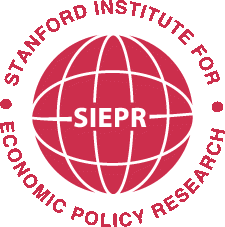

### Stanford Institute for Economic Policy Research
#### Predoctoral Research Fellow: _2019--2022_

* Worked with Professor [Heidi Williams](https://heidi-williams.humsci.stanford.edu/) on projects related to the economics of innovation placing special focus on innovation in health care and drug development

* Processed, organized, and analyzed large data sets such as the United States Patent and Trademark Office Bulk Data Repository and Clarivate’s Web of Science bulk data

* Conducted original research as part of graduate coursework in the Stanford Economics department

&nbsp;

### Federal Reserve Bank of Boston
#### Research Intern: _Summer 2017 and Summer 2018_

* Worked with Senior Economist [Ali Ozdagli](https://www.ozdagli.org/) studying currency exchange and securities pricing
* Collected and analyzed data for ongoing working paper ["Monetary Shocks and Stock Returns: Identification Through the Impossible Trinity"](https://papers.ssrn.com/sol3/papers.cfm?abstract_id=2328966)
* Used Python to process bulk PDF archives to gather data for ["FOMC Communication and Interest Rate Sensitivity to News"](https://papers.ssrn.com/sol3/papers.cfm?abstract_id=3075842)

&nbsp;

&nbsp;

### Bowdoin College
#### Research Assistant: _Fall 2017_

* Worked with Assistant Professors [Matthew Botsch](https://www.bowdoin.edu/profiles/faculty/mbotsch/) and [Stephen Morris](https://sites.google.com/site/stephendmorris0/)
* Helped collect data for ["Job Loss Risk, Expected Mobility, and Home Ownership"](https://doi.org/10.1016/j.jhe.2020.101733)
